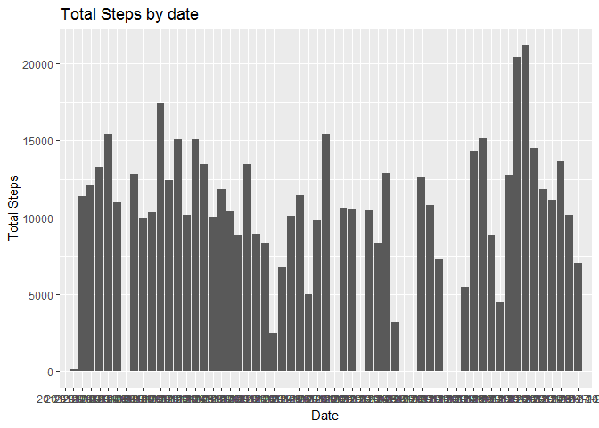
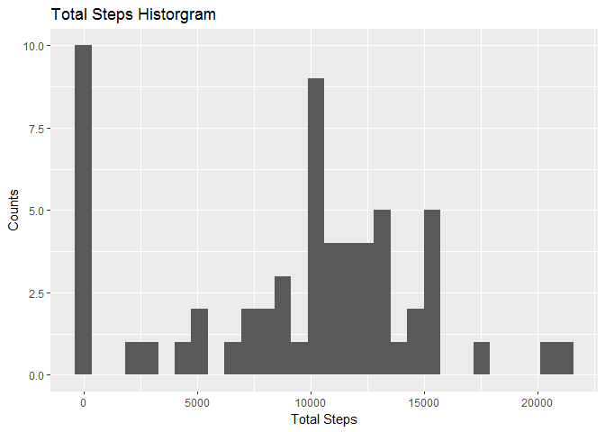
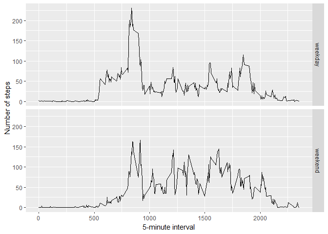

## Loading and preprocessing the data

```r
unzip(zipfile="activity.zip")
data <- read.csv("activity.csv")
```


## What is mean total number of steps taken per day?

```r
library(ggplot2)
data1<-data.frame(tapply(data$steps,data$date,sum,na.rm=TRUE))
data1$date<-rownames(data1)
rownames(data1)<-NULL
names(data1)[[1]]<-"Total Steps"
png("plot1.png")
#Total Steps by date bar chart
ggplot(data1,aes(y=data1$`Total Steps`,x=data1$date))+geom_bar(stat="identity") + ylab("Total Steps")+xlab("Date")+ggtitle("Total Steps by date")
```

```
## Warning: Use of `data1$date` is discouraged. Use `date` instead.
```

```
## Warning: Use of `data1$`Total Steps`` is discouraged. Use `Total Steps` instead.
```

```r
dev.off()
```

```
## png 
##   2
```

```r
ggplot(data1,aes(y=data1$`Total Steps`,x=data1$date))+geom_bar(stat="identity") + ylab("Total Steps")+xlab("Date")+ggtitle("Total Steps by date")
```

```
## Warning: Use of `data1$date` is discouraged. Use `date` instead.

## Warning: Use of `data1$`Total Steps`` is discouraged. Use `Total Steps` instead.
```

<!-- -->

```r
#Histogram of total steps
qplot(data1$`Total Steps`,geom="histogram",xlab="Total Steps",ylab="Counts",main="Total Steps Historgram")
```

```
## `stat_bin()` using `bins = 30`. Pick better value with `binwidth`.
```

<!-- -->

```r
png("plot1.1.png")
qplot(data1$`Total Steps`,geom="histogram",xlab="Total Steps",ylab="Counts",main="Total Steps Historgram")
```

```
## `stat_bin()` using `bins = 30`. Pick better value with `binwidth`.
```

```r
dev.off()
```

```
## png 
##   2
```


## What is the average daily activity pattern?


```r
library(ggplot2)
averages <- aggregate(x=list(steps=data$steps), by=list(interval=data$interval),
                      FUN=mean, na.rm=TRUE)
png("plot2.png")
ggplot(data=averages, aes(x=interval, y=steps)) +
  geom_line() +
  xlab("5-minute interval") +
  ylab("average number of steps taken")
dev.off()
```

```
## png 
##   2
```
On average across all the days in the dataset, the 5-minute interval contains
the maximum number of steps?

```r
averages[which.max(averages$steps),]
```

```
##     interval    steps
## 104      835 206.1698
```
## Imputing missing values

 There are missing values in the data which  are coded as `NA`.`NA` may introduce biases to some calculations of the data.


```r
missing <- is.na(data$steps)
# How many missing
table(missing)
```

```
## missing
## FALSE  TRUE 
## 15264  2304
```

All of the missing values are filled in with mean value for that 5-minute
interval.


```r
# Replace each missing value with the mean value of its 5-minute interval
fill.value <- function(steps, interval) {
    filled <- NA
    if (!is.na(steps))
        filled <- c(steps)
    else
        filled <- (averages[averages$interval==interval, "steps"])
    return(filled)
}
filled.data <- data
filled.data$steps <- mapply(fill.value, filled.data$steps, filled.data$interval)
```
 Using the filled data set, let's make a histogram of the total number of steps taken each day and calculate the mean and median total number of steps.


```r
total.steps <- tapply(filled.data$steps, filled.data$date, FUN=sum)
qplot(total.steps, binwidth=1000, xlab="total number of steps taken each day")
```

<!-- -->

```r
mean(total.steps)
```

```
## [1] 10766.19
```

```r
median(total.steps)
```

```
## [1] 10766.19
```

Mean and median values are higher after imputing missing data. In the original data, there are some day with `steps` values `NA`. The total number of steps taken in such days are set to 0 by default. However, after replacing missing `steps` values with the mean, these 0 values are removed from the histogramof total number of steps taken each day.

## Are there differences in activity patterns between weekdays and weekends?
First, let's find the day of the week for each measurement in the dataset.

```r
weekday.or.weekend <- function(date) {
    day <- weekdays(date)
    if (day %in% c("Monday", "Tuesday", "Wednesday", "Thursday", "Friday"))
        return("weekday")
    else if (day %in% c("Saturday", "Sunday"))
        return("weekend")
    else
        stop("invalid date")
}
filled.data$date <- as.Date(filled.data$date)
filled.data$day <- sapply(filled.data$date, FUN=weekday.or.weekend)
```
Now, let's make a panel plot containing plots of average number of steps taken
on weekdays and weekends.

```r
averages <- aggregate(steps ~ interval + day, data=filled.data, mean)
ggplot(averages, aes(interval, steps)) + geom_line() + facet_grid(day ~ .) +
    xlab("5-minute interval") + ylab("Number of steps")
```

<!-- -->
